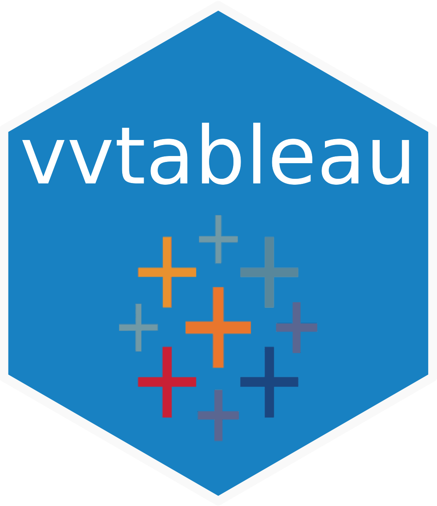

# vvtableau <a href='https://github.com/vusaverse/vvtableau'></a>

[](https://www.codefactor.io/repository/github/vusaverse/vvtableau)
[](https://github.com/vusaverse/vvtableau/actions/workflows/R-CMD-check.yaml)
[](https://CRAN.R-project.org/package=vvtableau/)
<a href="https://diffify.com/R/vvtableau" target="_blank"></a>
[](https://cran.r-project.org/package=vvtableau/)
[](https://cran.r-project.org/package=vvtableau/)

# Call for New Maintainer
> [!IMPORTANT]
> Due to a strategic transition from Tableau to Power BI at my workplace, I can no longer maintain this package. If you're interested in taking over maintenance or co-maintaining, please refer to pinned [issue #12](https://github.com/vusaverse/vvtableau/issues/12).


The `vvtableau` package is an R interface for interacting with Tableau Server using the Tableau REST API. It provides a convenient way to automate Tableau tasks, such as publishing workbooks, refreshing data extracts, managing users and groups, and retrieving information about server objects directly from R. Additionally, it includes functions to download filtered views, workbooks, and export them to different formats like PDF and PowerPoint.

Furthermore, methods are included to interact with Tableau desktop. These methods allow you to retrieve information from workbooks and to change them.


## Features
To see which functions are available in which section based on the Tableau REST API, helper functions, and functions that work with local Tableau workbooks using XML structure, please refer to the reference page of the vvtableau package. The [reference](https://vusaverse.github.io/vvtableau/reference/index.html) page provides a comprehensive list of functions available in the package, organized by category.

Additionally, the package includes vignettes that provide more detailed information on how to use the functions in the package.

## Installation

You can install the tableauR package from GitHub using the devtools package:

```{r}
devtools::install_github("vusaverse/vvtableau")
library(vvtableau)
```

The package is also available on CRAN:

```{r}
install.packages("vvtableau")
library(vvtableau)
```

## Contributing

Contributions to vvtableau are welcome! If you encounter any bugs, have feature requests, or would like to contribute code improvements, please open an issue or submit a pull request on the GitHub repository.
